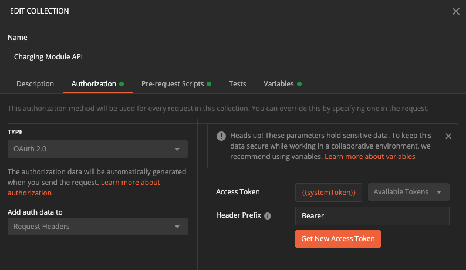

# Postman guide

Because the [Charging Module API (CHA)](https://github.com/DEFRA/) does not have a web UI, you need some means to interact with it. The current team's preference is the [Postman API client](https://www.postman.com/product/api-client/). This is not prescribed though and new members are free to use whatever they wish.

This guide is for those that choose Postman.

## Pre-requisites

You'll need to have [installed Postman](https://www.postman.com/downloads/) first.

> Because you need to be connected to Defra's OpenVPN to access the CHA you won't be able to use Postman on the web

## Importing the spec

We have an [OpenAPI](https://github.com/OAI/OpenAPI-Specification) spec of the CHA. By importing this into Postman it will automatically create a [Postman collection](https://www.postman.com/collection/) of requests, each setup correctly with path and query params and example request bodies. Using the [tags](https://swagger.io/docs/specification/grouping-operations-with-tags/) included in the spec we can also group the requests in the collection.

### Import the version *.yml

Each time we generate a release of the [Charging Module API](https://github.com/defra/charging-module-api) we also generate and publish an updated version of the spec to [SwaggerHub](https://swagger.io/tools/swaggerhub/). For example, [version v0.3.0](https://app.swaggerhub.com/apis-docs/sro/charging-module_api/v0.3.0). These versioned specs are what we import to Postman. You can find them in [openapi/versions](/openapi/versions). Depending on which version you are working with, you'll want a copy of the file downloaded and available on your machine.

In Postman select the **Import** option in the top left corner and then locate the spec file, for example `v0-3-0.yml`.

Once selected expand **Advanced options** and change **Folder organization** from `Paths` to `Tags`.

> Remember, you're welcome to ignore this, or alter the options as you see fit. We feel using tags groups the requests by purpose which helps with understanding how to work with the CHA.

Click **Import** and wait a few seconds for the process to complete.

## Authentication

You should now see a new collection named **Charging Module API**. Select the dotted button on the collection and then select **View more actions**.

Next select the **Authorization** tab. From the OpenAPI spec Postman should have correctly identified that we use [OAuth2](https://oauth.net/2/). The only thing you need to do here is enter `{{systemToken}}` into the **Access Token** field. Click **Update** to close.

### Admin authentication

Some of our endpoints can only be accessed by the `admin` user. This means when making requests against these endpoints you'll need to have a bearer token generated using the `admin` user's credentials.

To support this we need to tell Postman to use a different token when authenticating against admin endpoints.

If not expanded already open the **Charging Module API** collection. Then select the dotted button on the **admin** folder and select **Edit** from the context menu.

Again, you'll see the **EDIT COLLECTION** dialog. Select the **Authorization** tab. You'll see **Type** is set to `Inherit from parent`. Change this to `Oauth 2.0` and update the **Access Token** field to be `{{adminToken}}`. Click **Update** to close.

### Automatic token generation

To authenticate with the CHA you need a bearer token provided by [AWS Cognito](https://aws.amazon.com/cognito/). For a client service the normal flow would be to make a call to our Cognito endpoint with their client ID and password. The Cognito endpoint will return a bearer token that then needs to be sent as a header in all requests to the CHA. The bearer tokens have a life of 3 hours after which they need to be renewed.

The CHA when it receives the bearer token is able to determine

- whether the user is a client system or the admin user
- which regimes (cfd, pas, wrls, wml) the user has access to

Previous versions of our Postman files required first, making a request to the Cognito endpoint. Then copying and pasting the token received directly into the **Access Token** field we've been setting.

We've now developed a [pre-request script](https://learning.postman.com/docs/writing-scripts/pre-request-scripts/) that will automate this for you. It will also track the life of the token which means the Cognito endpoint is only called if the token does not exist or has expired.

Go back to the root **Charging Module API** node in the collection and click the dotted button again. This time select the **Pre-request Scripts** tab in the **Edit Collection** dialog. You'll need to copy the content of our [postman/pre_request_script.js](postman/pre_request_script.js) into it. Click **Update** to close.

## Environments

The last step is to setup your [Postman environments](https://learning.postman.com/docs/sending-requests/managing-environments/). These are a mechanism which supports having sets of named variables that your requests can refer to, for example, our access tokens `{{systemToken}}` and `{{adminToken}}`, which have different values depending on the environment selected.

> You can skip this step by speaking to an existing team member and grabbing a copy of their environment files. We include it here for completeness.

Team members will need to create 5 in total

- **CHA DEV**
- **CHA TEST**
- **CHA PRE**
- **CHA INT**
- **CHA PROD**

Each needs the following keys adding

- `baseUrl`
- `tokenUrl`
- `adminUser`
- `adminPass`
- `systemUser`
- `systemPass`

> For those working on client systems of the CHA, you just need to create one environment with values that connect to our INTEGRATIION environment. You also don't need to worry about the `adminUser` and `adminPass` variables. Admin is out of bounds!

You can gain access to the **Manage Environments** dialog using the button in the top right of Postman.

Click the add button, set the name, and add the key-value pairs. Click **Add** when done.

Repeat this for each AWS environment setting the values to match.

That's it! You are free to start making requests. We suggest trying these 2 endpoints to confirm you have everything working

- billrun -> List Bill Runs
- admin -> List Regimes

> Client system users remember, admin is off limits so those requests will not work for you

Other endpoints rely on providing recognised resource ID's in the path or updating the request 'body'. So use the list based endpoints to grab ID's and examples you can use to continue exploring.

### Local environment

For those actively developing the CHA you'll want to interact with a locally running instance. A key difference between the local environment and one in AWS is that we don't go through an AWS gateway when making our requests. So as long as we have a token the CHA just needs to be able to match it to one recorded in its authorised systems table. We don't have to worry about it expiring.

To do this use the **Duplicate Environment** option against **CHA DEV** in the **Manage Environments** dialog.

> You'll need to have hit the confirmation endpoints first in **CHA DEV** to ensure all variables needed have been created and populated.

Select the copy and update the environment name to **CHA LOCAL**. Then do the following

- Update the `baseUrl` value to be `http://localhost:3003` (or whatever you have the CHA running on)
- Add a new key-value `automateToken=false`

`automateToken` when set to `false` tells the pre-request script not to run. We don't need it for local requests. The end result should look something like this.

If you haven't already done so add the `systemUser` ID you've set in **CHA LOCAL** to your local CHA instance using the *admin -> Add Authorised System* request.
