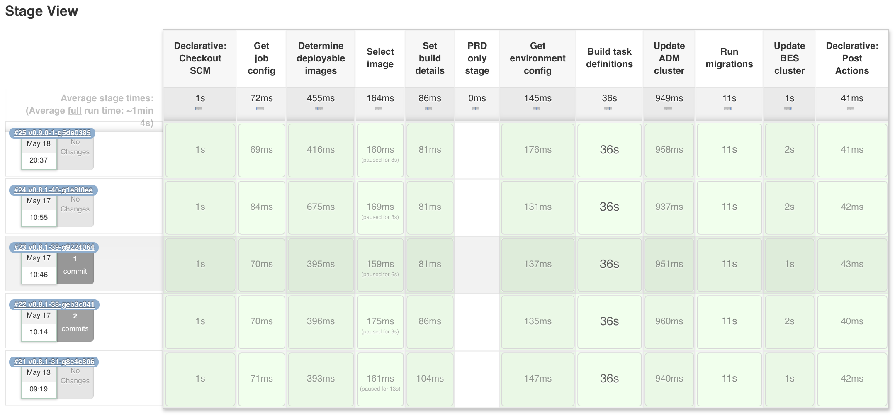

# Release process

This covers the release process for the [SROC Charging Module API](https://github.com/DEFRA/sroc-charging-module-api).

It covers

- Prepare
  - [Check for outstanding dependency PRs](#check-for-outstanding-dependency-prs)
  - [Check for missing labels](#check-for-missing-labels)
  - [Agree version](#agree-version)
  - [Update app version](#update-app-version)
  - [Generate git tag](#generate-git-tag)
  - [Update the CHANGELOG](#update-the-changelog)
  - [Build Docker image](#build-docker-image)
  - [Update pre-production Jenkins job](#update-pre-production-jenkins-job)
- Assure
  - [Test sign-off](#test-sign-off)
  - [User sign-off](#user-sign-off)
    - [Update integration Jenkins job](#update-integration-jenkins-job)
    - [Send INT release ready email to clients](#send-int-release-ready-email-to-clients)
    - [Create INT calendar appointment](#create-int-calendar-appointment)
    - [Deploy new version to integration](#deploy-new-version-to-integration)
    - [Send INT release done email to clients](#send-int-release-done-email-to-clients)
  - [Approval to release](#approval-to-release)
  - [If issues are found](#if-issues-are-found)
- Approve
  - [Agree date and time for release](#agree-date-and-time-for-release)
  - [Submit RfC](#submit-rfc)
  - [Prepare a release note](#prepare-a-release-note)
  - [Create calendar appointment](#create-calendar-appointment)
- Ship
  - [Deploy release](#deploy-release)
  - [Smoke test release](#smoke-test-release)
  - [Confirm release successful](#confirm-release-successful)
  - [Record release in GitHub](#record-release-in-github)
  - [In the event of errors](#if-issues-are-found)
    - [Deployment fails](#deployment-fails)
    - [Service fails](#service-fails)

## Prepare

This kicks in when the team feels thay have a 'release candidate'. Essentially a version of the app (code) they'd like to release to production.

### Check for outstanding dependency PRs

Don't worry about any draft feature or fix PR's. But any automated dependency PR's should be checked, approved and merged. These help ensure the app remains up to date and secure.

### Check for missing labels

> Caveat - we only care about PR's created during the current team's tenure. We don't have the capacity to work through all the previous PR's trying to determine what labels to assign

Review the merged PR's for missing labels eg `ehancement`, `bug` etc. These labels are used by the tool we use to automatically generate our CHANGELOGs.

### Agree version

We use [semantic versioning](https://semver.org/) to differentiate between patch, minor and major releases. We track an app's releases using [GitHub releases](https://docs.github.com/en/github/administering-a-repository/about-releases). Check the repo to confirm what the last one was.

The development team will then review the changes made to decide whether a major, minor, or patch version bump is needed.

> The 'version' agreed is what any reference to version below is referring to.

### Update app version

> IMPORTANT! Ensure you have checked out the `main` branch for the repo and performed a `git pull` to get the latest code first.

We need to update the version held in the app to match our new version. Update the version in the `package.json` then commit and push it.

```bash
git add package.json
git commit -m "Update VERSION"
git push
```

> You'll notice we don't create a PR. This and [updating the CHANGELOG](#update-the-changelog) are the only times we make an exception to the rule 'all changes on a branch'. We do this to avoid polluting our CHANGELOG with lots of `Update VERSION` and `Update CHANGELOG` entries.

### Generate git tag

We use [git annotated tags](https://git-scm.com/book/en/v2/Git-Basics-Tagging) to track our releases and control what Jenkins actually deploys.

Create a new version tag, for example

```bash
git tag -a v0.8.1 -m "Version 0.8.1"
```

Then push the tag to GitHub.

```bash
git push origin v0.8.1
```

**Do not** create the release in GitHub at this time. We record the release in GitHub *after* the app is shipped to production.

### Update the CHANGELOG

We use [github-changelog-generator](https://github.com/github-changelog-generator/github-changelog-generator) to generate our CHANGELOGs. The following assumes you have the gem installed (it can be run [using Docker](https://github.com/github-changelog-generator/github-changelog-generator#running-with-docker)).

From the root of the project run this

```bash
github_changelog_generator -u DEFRA -p sroc-charging-module-api
```

The generator will update the `CHANGELOG.md`. Open the file to confirm it has picked up the new tag and generated the changelog as expected. Then commit the update.

```bash
git add CHANGELOG.md
git commit -m "Update CHANGELOG"
git push
```

> You'll notice we don't create a PR. This and [updating the app version](#update-the-app-version) are the only times we make an exception to the rule 'all changes on a branch'. We do this to avoid polluting our CHANGELOG with lots of `Update VERSION` and `Update CHANGELOG` entries.

### Build Docker image

Building of the Docker image *should* be automatically handled by the [Jenkins](https://cha-jenkins.aws-int.defra.cloud/) `BLD_02_CMA_BUILD_AND_PUSH` job. But because it relies on polling GitHub there can be times that it skips a version, especially if changes are happening quickly.

If this happens find the `BLD_03_API_BUILD_AND_PUSH_RELEASES` job. Click the *Build Now* button and wait for it to succeed. Then confirm a new image with the version tag has been pushed to [Artifactory](https://artifactory-ops.aws-int.defra.cloud/artifactory/webapp/#/artifacts/browse/tree/General/sroc/sroc-charging-module-api).

### Update pre-production Jenkins job

In Jenkins find the pre-production deployment job, update the env var used to control the version deployed, then click the *Build Now* button.

For the CHA the job is `PRE_01_CHA_DEPLOY`. Click *Configure* and then update the `DEPLOY_TAG` env var in the *Properties Content* field.

```bash
DEPLOY_ENV=pre
DEPLOY_TAG=v0.8.1
```

## Assure

The next stage is managed by QA & Test with support from development if needed. With the release candidate deployed to the pre-production environment it is the responsibility of the test analyst to 'sign it off'.

### Test sign-off

Normally this would involve running the full suite of regression tests plus any additional manual testing felt necessary to confirm the expected functionality is included and still working. The release can then be given its 'test signoff'.

For reference our automated acceptance tests for the CHA can be found in [SROC Charging Module API Acceptance tests](https://github.com/DEFRA/sroc-cha-acceptance-tests).

### User sign-off

After being confirmed as **ready** by test, we need to deploy the CHA to our **integration** environment. This is to allow users of the API time to confirm existing functionality isn't broken, and make changes to their apps to take advantage of any feature changes made.

#### Update integration Jenkins job

For the CHA the job is `INT_01_CHA_DEPLOY`. Click *Configure* and then update the `DEPLOY_TAG` env var in the *Properties Content* field.

```bash
DEPLOY_ENV=tra
DEPLOY_TAG=v0.8.1
```

Do **not** click the *Build Now* button! That comes later 😁

#### Send INT release ready email to clients

> At this time the WRLS team is our only client system!

Create an email with approximately the following format and send to the client service's development and test team leads. In `CC` add from the SROC team

- project manager
- test manager
- test analyst
- dev team

```text
Subject: SROC Charging Module API - v0.8.1 ready for release to INTEGRATION

Hello

This is to let you know we are ready to release v0.8.1 of the SROC Charging Module API to the INTEGRATION environment.

The CHANGELOG for v0.8.1 is below. You can find the full CHANGELOG at https://github.com/DEFRA/sroc-charging-module-api/blob/master/CHANGELOG.md

[Copy and paste contents of CHANGELOG for version about to be released]

We just need to confirm with you a suitable date and time to update the environment.

[Sign off]
```

#### Create INT calendar appointment

Once a date and time has been agreed create a calendar appointment with approximately the following format in your Defra Outlook. Invite the client service's development and test team leads. In `optional` add from the SROC team

- project manager
- test manager
- test analyst
- dev team

```text
Title: SROC Charging Module API - Release v0.8.1 to INTEGRATION

No actual meeting will take place!

This is just a reminder to all that the SROC Charging Module API INTEGRATION environment will be updated at this time.
```

This will serve as both a confirmation and reminder to all of the agreed date and time.

#### Deploy new version to integration

At the agreed time and date, find the `INT_01_CHA_DEPLOY` job in the Jenkins instance for the service. Then click the *Build Now* button and wait for it to succeed.

#### Send INT release done email to clients

Create an email with approximately the following format and send to the client service's development and test team leads. In `CC` add from the SROC team

- project manager
- test manager
- test analyst
- dev team

```text
Subject: SROC Charging Module API - v0.8.1 released to INTEGRATION

Hello

This is to let you know that v0.8.1 of the SROC Charging Module API has been released to the INTEGRATION environment.

Any issues or questions please let us know.

[Sign off]
```

### Approval to release

Once all testing phases are complete we just need confirmation from the team's test manager that we are ok to proceed to the [approval phase](#approve) of the release.

### If issues are found

We abort the release process if issues are found that will require code changes.

Those changes would be managed within the team as normal; logged, prioritised and planned into a sprint. Once implemented if the team feels the application is again ready for release we start the whole process again.

This includes creating a new tag (version) for the application. We **do not** reuse tags which have previously been generated.

## Approve

Any service that is 'live' in Defra requires submitting a [Request for Change (RfC)](https://wiki.en.it-processmaps.com/index.php/Checklist_Request_for_Change_RFC) before changing anything in production.

This applies to _all_ changes. Even something as small as changing the value of an environment variable requires an RfC!

The RfC needs to be approved by DDTS Change Management before you can proceed with the release.

### Agree date and time for release

We need to co-ordinate the date and time for the release with these stakeholders.

- our team, specifically the product owner on behalf of the business
- teams that use the service
- web-ops as they perform all releases and updates to production environments

This should also take into account the type of change being requested.

- **Normal** - release in 2 weeks' time or later
  - Approvals are sought by email by the Change management team before approving the RfC
- **Expedited** - release in 4-10 working days
  - The next Change Approval Board (CAB) will discuss the RfC . Someone from the team will need to attend to answer any questions before they grant approval
- **Emergency** - release within 3 working days
  - An emergency CAB will convene to discuss the RfC. Someone from the team will need to attend to answer any questions before they grant approval. These are _really_ discouraged by Change management and you _will_ be challenged on why it is needed.

### Submit RfC

Submit the RfC in [myIT](https://defra.service-now.com) (also known as **Service Now**). You'll need to be on the corporate network to access **myIT**. For those without a corporate laptop access from your phone is the only option 😞.

> Because the CHA currently has no rollback mechanism ensure the 'change window' (the start and endtime for the change) is as large as possible. Within the window updates can be deployed. Once closed all further changes need to be raised on a new RfC.

### Prepare a release note

To ensure everyone involved in shipping the release is clear on what actions are needed, prepare a [release note](https://gitlab-dev.aws-int.defra.cloud/open/release-notes).

There are plenty of existing ones to base it on covering a number of different types of 'release'. As an example, a simple update to the CHA would be

```markdown
# 19 May 2021

- CHG0012345
- No downtime required
- Scheduled 10am

## Release process

### Prior to release

- **web-ops** - Update property `DEPLOY_TAG=v0.8.1` in `PRD_01_CHA_DEPLOY` job in Jenkins

### Release day

- **web-ops** - `PRD_01_CHA_DEPLOY` job ran in Jenkins
- **delivery team** - Smoke test that service is up and operating as expected
```

### Create calendar appointment

Once a date and time has been agreed create a calendar appointment with approximately the following format in your Defra Outlook. Invite the appointed web-ops and test analyst carrying out the release. In `optional` add from the SROC team

- project manager
- test manager
- dev team

```text
title: SROC Charging Module API - Release [version] to PRODUCTION

[Copy of release note content]

[Link to release note]
```

This will serve as both a confirmation and reminder to all of the agreed date and time.

## Ship

This covers everything on the day of release and after. All being well and for the majority of releases this should be the shortest and simplest phase.

### Deploy release

We typically have no direct involvement as all changes to production are done by web-ops. At least one person from the development team should be on hand to answer any questions or deal with any issues that arise.

### Smoke test release

Once web-ops confirm the changes have been applied, the test analyst will perform a series of [smoke tests](https://en.wikipedia.org/wiki/Smoke_testing_(software)) to confirm the service is still up and running.

### Confirm release successful

Create an email with approximately the following format and send to **SM-Defra-Change Management**. In `CC` add web-ops lead plus from the SROC team

- project manager
- test manager
- test analyst
- dev team

```text
Subject: [RfC reference] completed successfully

Hello

This is to let you know [RfC reference] for the SROC Charging Module API was completed successfully.

[Sign off]
```

### Record release in GitHub

We use [GitHub's release](https://docs.github.com/en/github/administering-a-repository/about-releases) functionality to track our releases to production. They form a quick and handy reference as to what versions of the code got released to production and when.

Go to the relevant GitHib project and select the 'Releases' tab then click the *Draft a new release* button. Complete fields as per the example below


The link for the changelog can be found in `CHANGELOG.md`. Look for the heading which matches the version just released.

### In the event of errors

If issues are found next steps will depend on where and when they happen, and their severity. In principle we aim for a 'fix-forward' approach; stick with the release but aim to roll out another expedited/emergency release as soon as possible.

#### Deployment fails

The TCM uses a deployment tool called [Capistrano](https://capistranorb.com/). It coupled with the Ruby framework supports automatic rollback of failed deployments. If something fails during deployment, you can be confident no changes have been made.

With the CHA there is no such tool. The deployment is based on telling [AWS ECS](https://aws.amazon.com/ecs/) to

- update it's [task definition](https://docs.aws.amazon.com/AmazonECS/latest/developerguide/task_definitions.html) (basically a config file which details which image to run and with what config values)
- stop any existing containers (running instances of the app) and replace them with ones based on what's in the updated task definition

So, we won't truly know a deployment has failed until AWS ECS starts trying to use the new Docker image. This means its highly unlikely a deployment will fail but if it does, which stage it failed at will determine what you need to do.



- If it fails on or before *Update ADM cluster* then nothing has changed
- If it fails on *Run migrations* then the ADM cluster has been updated to use the new Docker image and possibly some changes have been made to the database
- If it fails on *Update BES cluster* then not only does the above apply, but the main BES cluster has been updated to use the new Docker image and possibly been told to immediately start using it

Try to determine what the fault was with the deployment process and rectify, and then re-run. All stages need to be green to ensure the environment is updated correctly.

If the failure was before *Update BES cluster* and you can't get deployment green, test the service to see if its still working using the old version. The answer to this will determine the priority of resolving the issue and whether an **emergency**, **expedited**, or **normal** RfC is needed.

If it fails on *Update BES cluster* treat it as a [Service fails](#service-fails).

#### Service fails

If the deployment was successful but smoke testing raises an issue with the service, convene an urgent team call. Key folks needed are

- representation from the business
- representation from development
- representation from test
- project manager

The issue and its impact to users needs to be discussed; are there workarounds, how many users affected, how often will the issue occur etc?

A key factor for the CHA is that there is currently no rollback mechanism. Therefore fixing forward is the only option.

Accepting you're in the middle of the crisis, the team should use its best judgement whether the issue can be diagnosed and fixed in the change window or if a new RfC will be needed.

If *fixing-forward* on a new RfC confirm the release as completed to [SM-Defra-Change Management](changeadministration@defra.gov.uk) but alter the email to let them know an issue was found and another RfC will need to be raised to deal with it.
