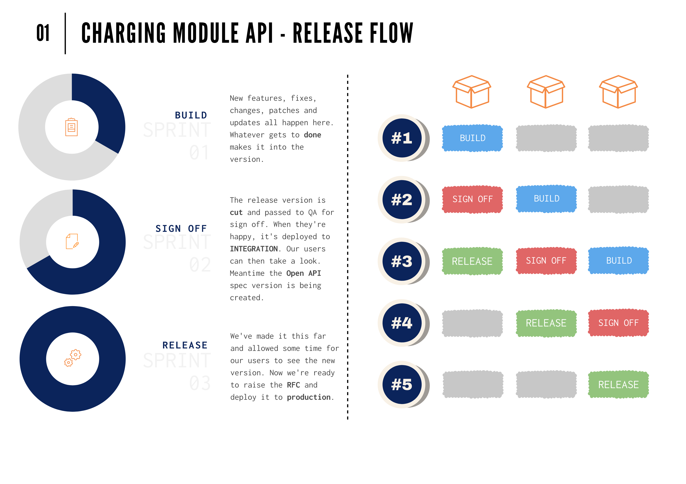

# SROC Charging Module API

This guide documents the **sign off** and **schedule** stages for the CHA. It also includes notes for the **release** day.

- [Sign off](/releasing/cha/sign_off.md)
- [Schedule](/releasing/cha/schedule.md)
- [Release](/releasing/cha/release.md)

## Our responsibilities

The CHA is a 'shared' API for other services. It is intended to be used by systems across the EA and Defra where charging functionality is needed. Because of this the team has a responsibility to those servics when it comes to making changes.

### Fixes first

The CM team has committed to fixing 'bugs' first before working on new features or improvements. For example, if the team were currently in Sprint 58 and a client system raised an issue

- Initial investigation is immediately conducted
  - The CM team will then determine if the issue is a bug. The CM team have the final say on whether something is a bug.
- The bug is prioritised
  - Typically, any new bugs will automatically be assigned to the next sprint (Sprint 59 in our example). The team will already have made commitments on the work in the current sprint which they don't want to risk. However, if the team deem the issue a high priority it _will_ be brought into the current sprint. Again, the CM team have the final say.

### No breaking changes

To be trusted the API must not change in such a way that existing client system functionality would break. So, the team have committed to not making any changes to existing endpoints that could be considered 'breaking'. For example,

- endpoints are removed or renamed
- data values are removed or renamed in an endpoint's JSON response
- response structure is changed
- new mandatory request properties are added
- existing optional request properties are changed to mandatory
- the defaults for existing request properties are changed
- key changes in behaviour, for example, if the `/send` endpoint no longer generated the transaction file

Not all changes are breaking though. Dependency patching and the addition of new endpoints are clear examples of non-breaking changes. Bug fixes are also not considered breaking even if they result in one of the changes listed above. This is because the team consider the behaviour post-fix to be the 'normal expected state' for the API. The fix is just ensuring this is the case. Other examples of non-breaking changes are

- making a mandatory request property optional
- adding optional request properties
- adding new reponse properties to a schema

### Versioned changes

If a breaking change is needed it will be done using versioning. For example, the current endpoint for creating new bill runs is `POST /v2/{regimeSlug}/bill-runs`. If we needed to make a breaking change to how bill runs are created we would add a new `POST /v3/{regimeSlug}/bill-runs` endpoint. The breaking change would be made there but the existing behaviour will be retained and supported on the `v2` endpoint.

It would be marked as `deprecated` though by adding the following headers to its response

- `deprecation: true`
- `link: </v3/{regimeSlug}/bill-runs>; rel="successor-version"`

The CM team will determine how long the old behaviour is supported and when eventually the `/v2` endpoint is removed from the API.

#### Normalisation

With versioned endpoints there is a possibility that client systems would be required to call endpoints using a series of different versions. This will lead to confusion both for the client system teams and us.

So, when the CM team determine it necessary the API version will be _normalised_. By this we mean

- the greatest version being used by an endpoint will be identified
- all endpoints will have a matching version created
- all existing endpoints will be updated to return the deprecation headers

At some point the old version endpoints would be removed from the API and the new versioned ones would become the 'base' version.

### The INTEGRATION environment

Also referred to as `TRA` or `TRAINING` by web-ops the integration environment is a 24/7 AWS environment that mirrors the CHA `PRODUCTION` environment. The CM team support and maintain it. It is provided so client systems have somewhere they can develop and test their systems against.

> The `TRA` designation comes from the fact the environment was originally created to support training. The use and name changed but the Ansible and Terraform scripts had been written hence the `TRA` prefix remains!

The last step of our sign off process is deploying the signed off release candidate to the integration environment. Client system teams can then prepare and test their services ahead of the its deployment to `PRODUCTION`.

Note; we don't await confirmation they have tested as we have purposefully **not** made client approval a step in our sign off process. But if a breaking change was found we would investigate and react accordingly.

## Release flow

Like the other services we maintain the release flow encompasses 3 stages

- Build
- Sign off
- Release (schedule)

In the TCM for example, we have a direct relationsip with our service's users. In the CHA our users are other services. So, we need a predictable pattern to when things happen so the other teams can plan their work accordingly.

The following graphic outlines our release flow for the CHA. Putting the sign off and release (schedule) in separate sprints is what ensures there is some time for client teams to test and prepare using `INTEGRATION`. Expedited and emergency RfC's if required will curtail this time but these are expected to be the exception rather than the norm.

