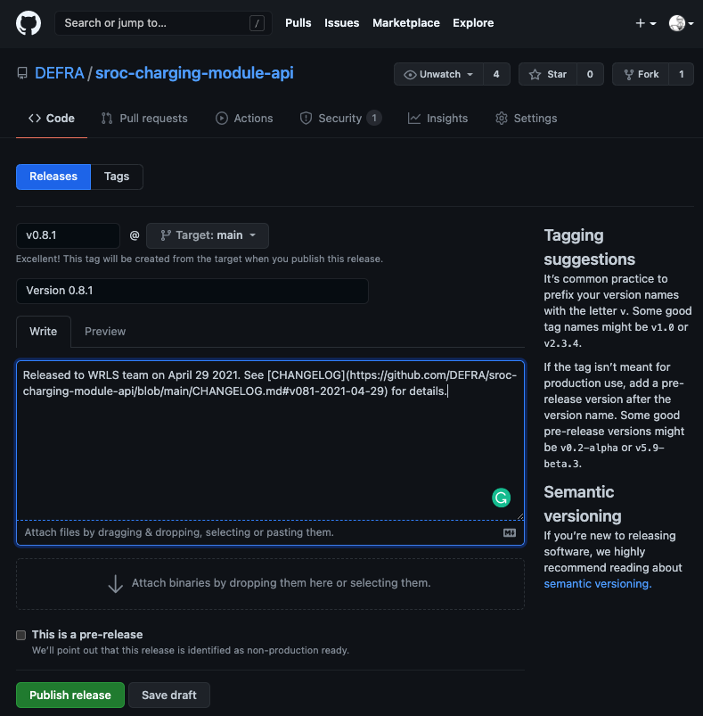
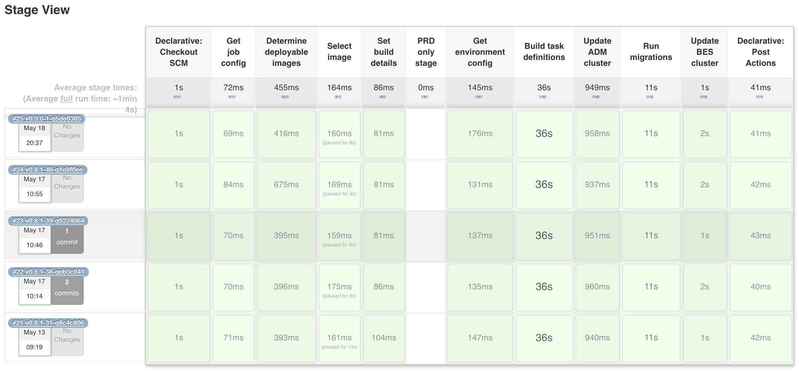

# CHA - Release

This covers everything on the day of release and after. All being well and for the majority of releases this should be short and simple.

It covers

- [Deploy release](#deploy-release)
- [Smoke test release](#smoke-test-release)
- [Confirm release successful](#confirm-release-successful)
- [Record release in GitHub](#record-release-in-github)
- [In the event of errors](#if-issues-are-found)
  - [Deployment fails](#deployment-fails)
  - [Service fails](#service-fails)

## Deploy release

We typically have no direct involvement as all changes to production are done by web-ops. At least one person from the development team should be on hand to answer any questions or deal with any issues that arise.

## Smoke test release

Once web-ops confirm the changes have been applied, the test analyst will perform a series of [smoke tests](https://en.wikipedia.org/wiki/Smoke_testing_(software)) to confirm the service is still up and running.

## Confirm release successful

We need to send 2 emails; one to change management to confirm the RfC was successful and the other to the regime leads and the rest of the CM team.

### Change management

Create an email with approximately the following format and send to **SM-Defra-Change Adminstration**. In `CC` add web-ops shared email (**SM-Defra-ddts-aws-webops**).

```text
Subject: [RfC reference] completed successfully

Hello

This is to let you know [RfC reference] for the Charging Module API service was completed successfully.

[Sign off]
```

### Client team leads

Create an email with approximately the following format and send to the client team delivery managers and product owners (check with the team who they are as we don't want to include their emails in a public document). In `CC` add the members of the CM team.

```text
Subject: Charging Module API v0.14.1 release - successful

Hello

This is just to confirm the latest release of the Charging Module API v0.14.1 was completed successfully this morning.

[Sign off]
```

## Record release in GitHub

We use [GitHub's release](https://docs.github.com/en/github/administering-a-repository/about-releases) functionality to track our releases to production. They form a quick and handy reference as to what versions of the code got released to production and when.

Go to the relevant GitHib project and select the 'Releases' tab then click the *Draft a new release* button. Complete fields as per the example below



The link for the changelog can be found in `CHANGELOG.md`. Look for the heading which matches the version just released.

## In the event of errors

If issues are found next steps will depend on where and when they happen, and their severity. In principle we aim for a 'fix-forward' approach; stick with the release but aim to roll out another expedited/emergency release as soon as possible.

### Deployment fails

The TCM uses a deployment tool called [Capistrano](https://capistranorb.com/). It coupled with the Ruby framework supports automatic rollback of failed deployments. If something fails during deployment, you can be confident no changes have been made.

With the CHA there is no such tool. The deployment is based on telling [AWS ECS](https://aws.amazon.com/ecs/) to

- update it's [task definition](https://docs.aws.amazon.com/AmazonECS/latest/developerguide/task_definitions.html) (basically a config file which details which image to run and with what config values)
- stop any existing containers (running instances of the app) and replace them with ones based on what's in the updated task definition

So, we won't truly know a deployment has failed until AWS ECS starts trying to use the new Docker image. This means its highly unlikely a deployment will fail but if it does, which stage it failed at will determine what you need to do.



- If it fails on or before *Update ADM cluster* then nothing has changed
- If it fails on *Run migrations* then the ADM cluster has been updated to use the new Docker image and possibly some changes have been made to the database
- If it fails on *Update BES cluster* then not only does the above apply, but the main BES cluster has been updated to use the new Docker image and possibly been told to immediately start using it

Try to determine what the fault was with the deployment process and rectify, and then re-run. All stages need to be green to ensure the environment is updated correctly.

If the failure was before *Update BES cluster* and you can't get deployment green, test the service to see if its still working using the old version. The answer to this will determine the priority of resolving the issue and whether an **emergency**, **expedited**, or **normal** RfC is needed.

If it fails on *Update BES cluster* treat it as a [Service fails](#service-fails).

### Service fails

If the deployment was successful but smoke testing raises an issue with the service, convene an urgent team call. Key folks needed are

- representation from the business
- representation from development
- representation from test
- project manager

The issue and its impact to users needs to be discussed; are there workarounds, how many users affected, how often will the issue occur etc?

A key factor for the CHA is that there is currently no rollback mechanism. Therefore fixing forward is the only option.

Accepting you're in the middle of the crisis, the team should use its best judgement whether the issue can be diagnosed and fixed in the change window or if a new RfC will be needed.

If *fixing-forward* on a new RfC confirm the release as completed to **SM-Defra-Change Administration** but alter the email to let them know an issue was found and another RfC will need to be raised to deal with it.
