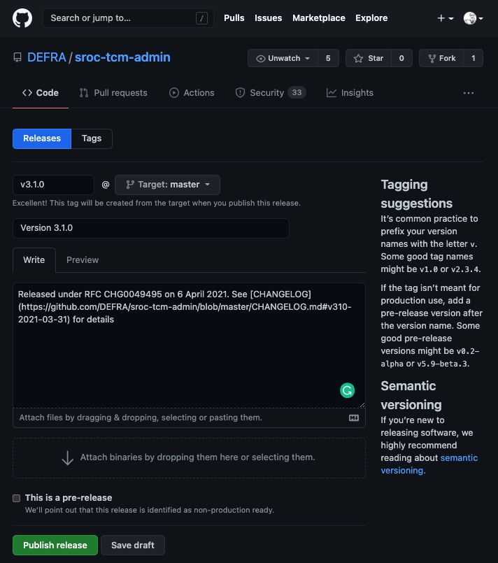

# TCM

This covers the release process for the [Tactical Charging Module](https://github.com/DEFRA/sroc-tcm-admin).

It covers

- Prepare
  - [Check for outstanding dependency PRs](#check-for-outstanding-dependency-prs)
  - [Check for missing labels](#check-for-missing-labels)
  - [Agree version](#agree-version)
  - [Generate git tag](#generate-git-tag)
  - [Update the CHANGELOG](#update-the-changelog)
  - [Update pre-production Jenkins job](#update-pre-production-jenkins-job)
- Assure
  - [Test sign-off](#test-sign-off)
  - [Approval to release](#approval-to-release)
  - [If issues are found](#if-issues-are-found)
- Approve
  - [Agree date and time for release](#agree-date-and-time-for-release)
  - [Submit RfC](#submit-rfc)
  - [Prepare a release note](#prepare-a-release-note)
  - [Create calendar appointment](#create-calendar-appointment)
- Ship
  - [Deploy release](#deploy-release)
  - [Smoke test release](#smoke-test-release)
  - [Confirm release successful](#confirm-release-successful)
  - [Record release in GitHub](#record-release-in-github)
  - [In the event of errors](#in-the-event-of-errors)
    - [Deployment fails](#deployment-fails)
    - [Service fails](#service-fails)
    - [Rollback](#rollback)

## Prepare

This kicks in when the team feels thay have a 'release candidate'. Essentially a version of the app (code) they'd like to release to production.

### Check for outstanding dependency PRs

Don't worry about any draft feature or fix PR's. But any automated dependency PR's should be checked, approved and merged. These help ensure the app remains up to date and secure.

### Check for missing labels

> Caveat - we only care about PR's created during the current team's tenure. We don't have the capacity to work through all the previous PR's trying to determine what labels to assign

Review the merged PR's for missing labels eg `ehancement`, `bug` etc. These labels are used by the tool we use to automatically generate our CHANGELOGs.

### Agree version

We use [semantic versioning](https://semver.org/) to differentiate between patch, minor and major releases. We track an app's releases using [GitHub releases](https://docs.github.com/en/github/administering-a-repository/about-releases). Check the repo to confirm what the last one was.

The development team will then review the changes made to decide whether a major, minor, or patch version bump is needed.

> The 'version' agreed is what any reference to version below is referring to.

### Generate git tag

We use [git annotated tags](https://git-scm.com/book/en/v2/Git-Basics-Tagging) to track our releases and control what Jenkins actually deploys.

Create a new version tag, for example

```bash
git tag -a v3.1.0 -m "Version 3.1.0"
```

Then push the tag to GitHub.

```bash
git push origin v3.1.0
```

**Do not** create the release in GitHub at this time. We record the release in GitHub *after* the app is shipped to production.

### Update the CHANGELOG

We use [github-changelog-generator](https://github.com/github-changelog-generator/github-changelog-generator) to generate our CHANGELOGs. The following assumes you have the gem installed (it can be run [using Docker](https://github.com/github-changelog-generator/github-changelog-generator#running-with-docker)).

From the root of the project run this

```bash
github_changelog_generator -u DEFRA -p sroc-tcm-admin
```

The generator will update the `CHANGELOG.md`. Open the file to confirm it has picked up the new tag and generated the changelog as expected. Then commit the update.

```bash
git add CHANGELOG.md
git commit -m "Update CHANGELOG"
git push
```

> You'll notice we don't create a PR. This is the one time we make an exception to the rule 'all changes on a branch'. We do this to avoid polluting our CHANGELOGS with lots of `Update CHANGELOG` entries.

### Update pre-production Jenkins job

In [Jenkins](https://tcm-jenkins.aws-int.defra.cloud) find the pre-production deployment job, update the env var used to control the version deployed, then click the *Build Now* button.

For the TCM the job is `PRE_03_TCM_DEPLOY`. Click *Configure* and then update the `DEPLOY_BRANCH` param in the *General->Properties Content* field.

```bash
DEPLOY_BRANCH=v3.1.0
```

## Assure

The next stage is managed by QA & Test with support from development if needed. With the release candidate deployed to the pre-production environment it is the responsibility of the test analyst to 'sign it off'.

### Test sign-off

This involves running the full suite of regression tests plus any additional manual testing felt necessary to confirm the expected functionality is included and still working. The release can then be given its 'test signoff'.

For reference our automated acceptance tests for the TCM can be found in

- [SROC TCM Acceptance tests](https://github.com/DEFRA/sroc-tcm-acceptance-tests)
- [SROC acceptance tests](https://github.com/DEFRA/sroc-acceptance-tests)

### Approval to release

Once all testing phases are complete we just need confirmation from the team's test manager that we are ok to proceed to the [approval phase](#approve) of the release.

### If issues are found

We abort the release process if issues are found that will require code changes.

Those changes would be managed within the team as normal; logged, prioritised and planned into a sprint. Once implemented if the team feels the application is again ready for release we start the whole process again.

This includes creating a new tag (version) for the application. We **do not** reuse tags which have previously been generated.

## Approve

Any service that is 'live' in Defra requires submitting a [Request for Change (RfC)](https://wiki.en.it-processmaps.com/index.php/Checklist_Request_for_Change_RFC) before changing anything in production.

This applies to _all_ changes. Even something as small as changing the value of an environment variable requires an RfC!

The RfC needs to be approved by DDTS Change Management before you can proceed with the release.

### Agree date and time for release

We need to co-ordinate the date and time for the release with these stakeholders.

- our team, specifically the product owner on behalf of the business
- teams that use the service
- web-ops as they perform all releases and updates to production environments

This should also take into account the type of change being requested.

- **Normal** - release in 2 weeks' time or later
  - Approvals are sought by email by the Change management team before approving the RfC
- **Expedited** - release in 4-10 working days
  - The next Change Approval Board (CAB) will discuss the RfC . Someone from the team will need to attend to answer any questions before they grant approval
- **Emergency** - release within 3 working days
  - An emergency CAB will convene to discuss the RfC. Someone from the team will need to attend to answer any questions before they grant approval. These are _really_ discouraged by Change management and you _will_ be challenged on why it is needed.

### Submit RfC

Submit the RfC in [myIT](https://defra.service-now.com) (also known as **Service Now**). You'll need to be on the corporate network to access **myIT**. For those without a corporate laptop access from your phone is the only option 😞.

### Prepare a release note

To ensure everyone involved in shipping the release is clear on what actions are needed, prepare a [release note](https://gitlab-dev.aws-int.defra.cloud/open/release-notes).

There are plenty of existing ones to base it on covering a number of different types of 'release'. As an example, a simple update to the TCM would be

```markdown
# 06 April 2021

- CHG0049495
- No downtime required
- Scheduled 10am

## Release process

### Prior to release

- **web-ops** - Update property `DEPLOY_BRANCH=v3.1.0` in `PRD_03_TCM_DEPLOY` job in Jenkins

### Release day

- **web-ops** - `PRD_03_TCM_DEPLOY` job ran in Jenkins
- **delivery team** - Smoke test that service is up and operating as expected
```

### Create calendar appointment

Once a date and time has been agreed create a calendar appointment with approximately the following format in your Defra Outlook. Invite the appointed web-ops and test analyst carrying out the release. In `optional` add from the Charging Module team

- project manager
- test manager
- dev team

```text
title: Tactical Charging Module - Release [version] to PRODUCTION

[Copy of release note content]

[Link to release note]
```

This will serve as both a confirmation and reminder to all of the agreed date and time.

## Ship

This covers everything on the day of release and after. All being well and for the majority of releases this should be the shortest and simplest phase.

### Deploy release

We typically have no direct involvement as all changes to production are done by web-ops. At least one person from the development team should be on hand to answer any questions or deal with any issues that arise.

### Smoke test release

Once web-ops confirm the changes have been applied, the test analyst will perform a series of [smoke tests](https://en.wikipedia.org/wiki/Smoke_testing_(software)) to confirm the service is still up and running.

### Confirm release successful

Create an email with approximately the following format and send to **SM-Defra-Change Management**. In `CC` add web-ops lead plus from the Charging Module team

- project manager
- test manager
- test analyst
- dev team

```text
Subject: [RfC reference] completed successfully

Hello

This is to let you know [RfC reference] for the Tactical Charging Module service was completed successfully.

[Sign off]
```

### Record release in GitHub

We use [GitHub's release](https://docs.github.com/en/github/administering-a-repository/about-releases) functionality to track our releases to production. They form a quick and handy reference as to what versions of the code got released to production and when.

Go to the relevant GitHib project and select the 'Releases' tab then click the *Draft a new release* button. Complete fields as per the example below



The link for the changelog can be found in `CHANGELOG.md`. Look for the heading which matches the version just released.

### In the event of errors

If any errors occur the next steps will depend on where and when they happen, and their severity. In principle we aim for a 'fix-forward' approach; stick with the release but aim to roll out another expedited/emergency release as soon as possible.

#### Deployment fails

If deployment has failed, first confirm the currently running version of the service has not changed. As long as it hasn't then nothing has changed. Investigate the issue and determine the fault. If it can be fixed quickly without changes to the app code and web-ops are happy, try the deployment again.

Else report back to **SM-Defra-Change Management** the RfC was unsuccessful. Log the issue in the backlog and prioritise and implement as normal.

#### Service fails

If the deployment was successful but smoke testing raises an issue with the service, convene an urgent team call. Key folks needed are

- representation from the business
- representation from development
- representation from test
- project manager

The issue and its impact to users needs to be discussed; are there workarounds, how many users affected, how often will the issue occur etc?

Accepting you're in the middle of the crisis, the team should use its best judgement whether to prioritise an urgent fix or roll-back to a previous version.

If [rolling back](#rollback)

- web-ops will need to run the roll-back deployment for the service
- send email to **SM-Defra-Change Management** reporting the RfC as unsuccessful
- log the issue in the backlog and prioritise and implement as normal

If *fixing-forward* confirm the release as completed to **SM-Defra-Change Management** but alter the email to let them know an issue was found and another RfC will need to be raised to deal with it.

> If *fixing forward* the quickest you can get the fix in place under an emergency RfC is 3 days. You will also be *strongly* challenged on the severity of the issue and it's impact on the agency and its reputation.

#### Rollback

Only use rollback if the only option to return a service to stable operation is to return to the previous deployed version.

The rollback process for the TCM is

- web-ops run `PRD_11_TCM_ROLLBACK` job in Jenkins
- test engineer carries out smoke testing to confirm return of service
