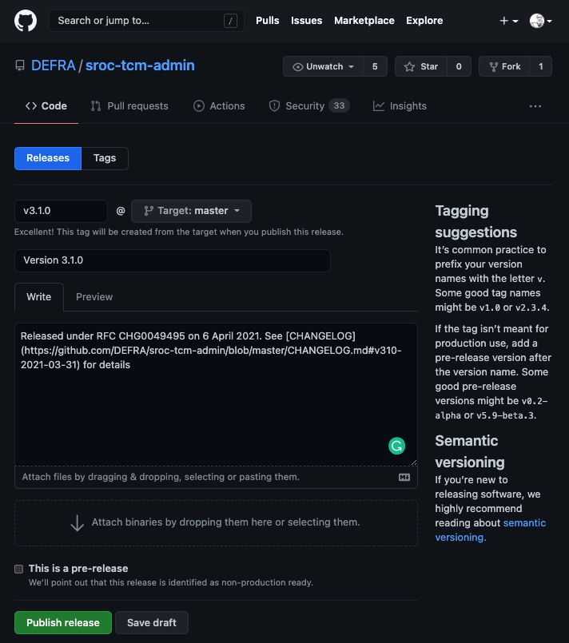

# TCM - Release

This covers everything on the day of release and after. All being well and for the majority of releases this should be short and simple.

It covers

- [Deploy release](#deploy-release)
- [Smoke test release](#smoke-test-release)
- [Confirm release successful](#confirm-release-successful)
- [Record release in GitHub](#record-release-in-github)
- [In the event of errors](#in-the-event-of-errors)
  - [Deployment fails](#deployment-fails)
  - [Service fails](#service-fails)
  - [Rollback](#rollback)

## Deploy release

We typically have no direct involvement as all changes to production are done by web-ops. At least one person from the development team should be on hand to answer any questions or deal with any issues that arise.

## Smoke test release

Once web-ops confirm the changes have been applied, the test analyst will perform a series of [smoke tests](https://en.wikipedia.org/wiki/Smoke_testing_(software)) to confirm the service is still up and running.

## Confirm release successful

We need to send 2 emails; one to change management to confirm the RfC was successful and the other to the regime leads and the rest of the CM team.

### Change management

Create an email with approximately the following format and send to **SM-Defra-Change Adminstration**. In `CC` add web-ops shared email (**SM-Defra-ddts-aws-webops**).

```text
Subject: [RfC reference] completed successfully

Hello

This is to let you know [RfC reference] for the Tactical Charging Module service was completed successfully.

[Sign off]
```

### Regime leads

Create an email with approximately the following format and send to the regime leads (check with the team who they are as we don't want to include their emails in a public document). In `CC` add the members of the CM team.

```text
Subject: Tactical Charging Module v3.1.0 release - successful

Hello

This is just to confirm the latest release of the Tactical Charging Module v3.1.0 was completed successfully this morning.

[Sign off]
```

## Record release in GitHub

We use [GitHub's release](https://docs.github.com/en/github/administering-a-repository/about-releases) functionality to track our releases to production. They form a quick and handy reference as to what versions of the code got released to production and when.

Go to the relevant GitHib project and select the 'Releases' tab then click the *Draft a new release* button. Complete fields as per the example below



The link for the changelog can be found in `CHANGELOG.md`. Look for the heading which matches the version just released.

## In the event of errors

If any errors occur the next steps will depend on where and when they happen, and their severity. In principle we aim for a 'fix-forward' approach; stick with the release but aim to roll out another expedited/emergency release as soon as possible.

### Deployment fails

If deployment has failed, first confirm the currently running version of the service has not changed. As long as it hasn't then nothing has changed. Investigate the issue and determine the fault. If it can be fixed quickly without changes to the app code and web-ops are happy, try the deployment again.

Else report back to **SM-Defra-Change Management** the RfC was unsuccessful. Log the issue in the backlog and prioritise and implement as normal.

### Service fails

If the deployment was successful but smoke testing raises an issue with the service, convene an urgent team call. Key folks needed are

- representation from the business
- representation from development
- representation from test
- project manager

The issue and its impact to users needs to be discussed; are there workarounds, how many users affected, how often will the issue occur etc?

Accepting you're in the middle of the crisis, the team should use its best judgement whether to prioritise an urgent fix or roll-back to a previous version.

If [rolling back](#rollback)

- web-ops will need to run the roll-back deployment for the service
- send email to **SM-Defra-Change Management** reporting the RfC as unsuccessful
- log the issue in the backlog and prioritise and implement as normal

If *fixing-forward* confirm the release as completed to **SM-Defra-Change Management** but alter the email to let them know an issue was found and another RfC will need to be raised to deal with it.

> If *fixing forward* the quickest you can get the fix in place under an emergency RfC is 3 days. You will also be *strongly* challenged on the severity of the issue and it's impact on the agency and its reputation.

### Rollback

Only use rollback if the only option to return a service to stable operation is to return to the previous deployed version.

The rollback process for the TCM is

- web-ops run `PRD_11_TCM_ROLLBACK` job in Jenkins
- test engineer carries out smoke testing to confirm return of service
