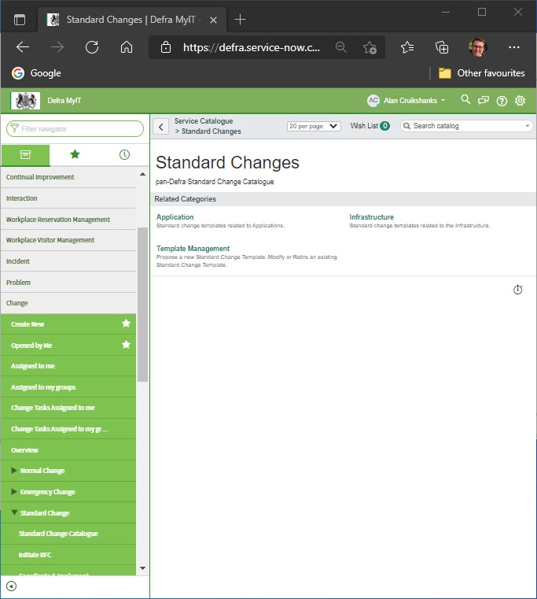
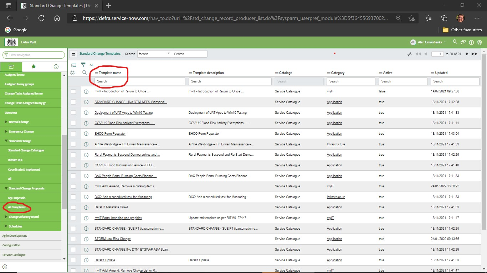
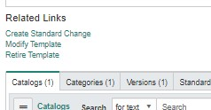

# RS RfC example

The following is an example of a completed myIT RfC for the [Rules service](/services/README.md). Unlike the [CHA](/rfc/cha.md) and the [TCM](/rfc/tcm.md) this is based on **Standard Change STDCHG0001214 - Charging Module Rules Service - Ruleset updates - Tactical Charging Module**.

> Normally each digital service maps to a 'configuration item' in myIT. All RfC's then link to the item. However, after the TCM configuration item was created all subsequent changes and issues for the CHA and RS were also logged against it. This is why you'll often see references to the TCM in CHA and RS related events.

You should be able to use it as the basis for new ones. Most fields will be completed for you because they come from the STDCHG0001214 template. This covers any additional fields you'll need to update that the template does not cover.

## Creating the RfC

We have found different members of the team see different menu options in myIT. [Option 1](#option-1) is the easiest but if you don't see `Standard Change Catalogue` [Option 2](#option-2) should work for you. In both cases once you have found the `Charge Module Rules Service - Ruleset updates` template a new RfC will appear pre-populated based on it. The rest of the guide covers the fields that still need completing.

### Option 1

In the myIT menu go to `Change -> Standard Change -> Standard Change Catalogue`. Select `Application` from the options presented. `Charge Module Rules Service - Ruleset updates` is normally near the top of the list but use the search if you are having trouble finding it. Select it when you have.

# Option 2

In the myIT menu go to `Change -> Standard Change -> All Templates`. In the `Template name` search field enter **Charge** then press 'Return/Enter' key.

`Charge Module Rules Service - Ruleset updates` should be one of the results (most likely the only one). Select it and you will be shown the proposal which was submitted to obtain approval for the standard change. Towards the bottom of the page is the 'Related links' section. Select `Create Standard Change`.

## Top section

### Department

> Defra

### Sponsor

> Gillian Welberry

## Schedule

The form will set the planned start date to `undefined`. For standard changes on a service like the CHA we would still need to liase with web-ops to pick a suitable time. For ruleset updates though we are in full control of the process.

### Planned start date

Select a date and time as agreed by the team, for example, `01/02/2022 09:30:00`

### Planned end date

Allow enough time to complete the change with some allowance for any possible issues, for example `01/02/2022 11:30:00`

## Risk assessment

There is no risk assessment for standard changes.
